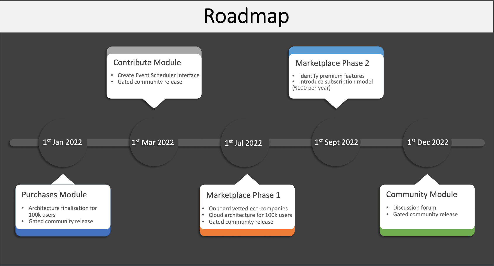

# Prakriti: Enabling Conscious Consumerism
Prakriti is an app that makes conscious consumerism accessible to all consumers wherever they may be in their eco-friendly journey. 

## Contents
* [Submission or Project Name](#Prakriti)
    * [Contents](#Contents)
    * [Short Description](#Short-description)
         * [What's the Problem?](#what's-the-problem)
         * [How Technology can help](#how-technology-can-help)
         * [The Idea](#the-idea)
    * [Demo Video](#Demo-video)
    * [The Architecture](#the-architecture)
    * [Long Description](#Long-description)
    * [Project Roadmap](#Project-Roadmap)
    * [Getting Started](#Getting-started)
    * [Built-with](#Built-with)
    * [Acknowledgments](#Acknowledgments)

## Short Description
### What's the Problem
Climate change that was once a distant possibility has now found its way into normal parlance. Its effects are alarming, with temperatures soaring, water levels depleting, all ultimately resulting in loss of life. Responsible consumption is the need of the hour and we need to spark collective action on a mass-scale to protect our Mother Earth. Multiple surveys over the past few years show that an increasing percentage of the population wants to buy purpose-driven brands. However green or conscious consumerism is easier said than done. It involves making drastic behavioural shifts, making the right choices in this age of information influx. To enable this, we need to make conscious consumerism more realistic and the decision-making process easier by making the relevant information easily accessible.

### How Technology can help
Technology is the way forward to solve a problem as complex as this. In order to bring the required behavioural shifts in consumers, easy access to information, sustainable marketplace and community support needs to be provided. Technology can help consumers to interpret the ocean of data available. Using IBM’s Watson Discovery an average consumer can access and comprehend data from 25 million global media sources to gauge the sustainability sentiment of a company. ESG (environmental, social, and corporate governance) scores based on thoroughly researched data can be scraped and delivered to consumers pre and post purchase to help choose better. Gamification by reading purchase bills using OCR can help add the ‘fun’ element to reinforce the behaviour. Technology also plays a pivotal role  in bringing multiple remote players together to form a sustainable marketplace and a supportive community in an effort towards realising a circular economy.

### The Idea
Prakriti is an app that makes conscious consumerism accessible to all consumers wherever they may be in their eco-friendly journey. The first feature is instant access to metrics that measures any brand's eco-friendly quotient (ESG score + IBM Watson sentiment score) in a gamified manner so that good choices are incentivized through 'green points'. It also has a marketplace for those willing to take an extra step by discovering local and recycled products near them. And the final feature is a community page for the seasoned eco-conscious consumer to share their wisdom and help others in the transition towards conscious consumerism.

## Demo Video

## The Architecture

* The user opens the app and has options of either directly searching the product name or uploading the bills
* The Search Db module will take the product entered by user and fetches the ESG/Discovery sentiment score from IBM cloudant
* The OCR module will detect the products from the uploaded bill and fetches ESG/Discovery sentiment score from IBM Cloudant
* Watson Discovery fetches sustainability sentiments from global media
* ESG scores are scraped from the web

## Long Description
[Long Description of the solution](https://github.com/shalu143/Call_for_Code/blob/main/Documents/Long_Description.md)

## Project Roadmap

## Getting Started
There are three parts to the project
* Run the ESG/Discovery sentiments codes to fetch the ESG/Discovery score to populate the IBM cloudant DB
* Flask API for OCR/ searching module to fetch the ESG/Discovery sentiment Score
* Angular app for the front- end

To get started, deploy the API in the local host/production server and update the URl in the angular after-upload and upload app components.
The final step is to deploy the Angular app in local host/production server

## Built-with
* [IBM Watson Discovery News](https://www.ibm.com/watson/services/discovery-news/)
* [IBM Cloudant](https://www.ibm.com/cloud/cloudant)
* [IBM OCR Module on Watson Studio](http://max-ocr.codait-prod-41208c73af8fca213512856c7a09db52-0000.us-east.containers.appdomain.cloud/)

## Acknowledgments
we would like to acknowledge the guidance provided by our Mentors Mr Rajnish Kumar and Mr Kunal Chhajer 
 
ESG Scores from Yahoo Finance
